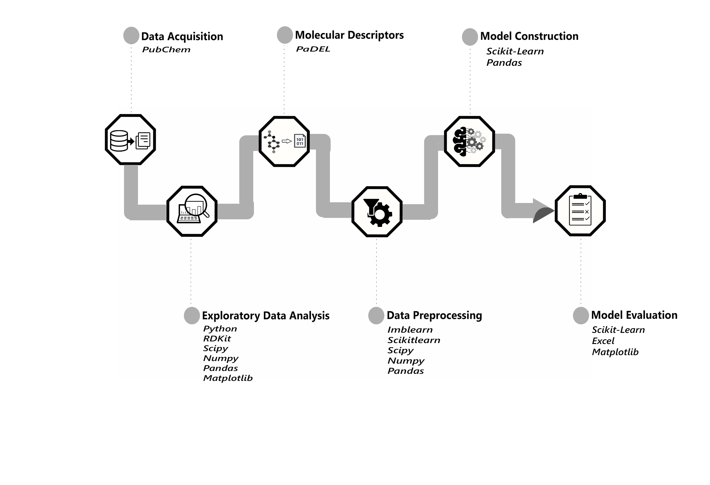

**Machine Learning Models Predict Inhibitiorys of Dengue Virus 2**

This repository is the code implementation of the paper: Machine Learning Models Predict Inhibitiorys of Dengue Virus 2. Random Forest came out as the best performing(**accuracy = 0.94**, **precision = 0.94**, **recall = 0.94**, **F1-score = 0.94**). It had an **AUC of 0.8** and **Mathew Correlation Coefficient (MCC) of 0.61**.

The methodology employed in the the figure is summerized in the figure below:

The dataset utillized in this project is a dataset of compound screened against the Dengue Virus 2 (DENV2). It can be found [here](https://pubchem.ncbi.nlm.nih.gov/bioassay/651640#section=Result-Definitions).
The script for each step of the project is saved in separate folders with the dataset required to run that step. To reproduce this work rerun the .py files in each folder (except the Molecular Descriptors step that require running PaDEL).

To run just the training and evaluation of the models, run the `models.py` script in the `7. Build Models folder`. The performance of the model will be saved as text files the `Evaluation` folder.
The path of the datasets in the `models.py` script can be changed to train and/or test the algorithms on a new dataset.

**Credit**

[Data Professor YouTube Channel](https://www.youtube.com/c/DataProfessor) 
